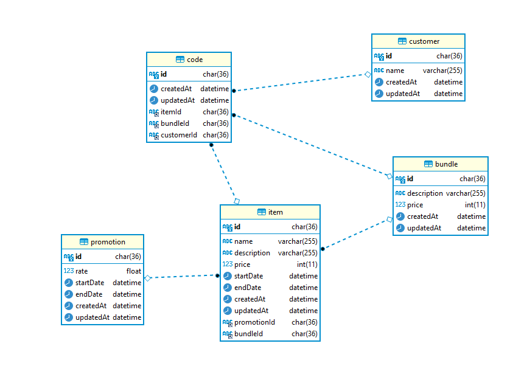

# แนวคิดการออกแบบ Database

- ในส่วนของข้อมูลของสินค้าจะแยกออกเป็น 2 table คือ item และ promotion เป็น One to One โดย ใน item จะเก็บชื่อ รายละเอียดสินค้า และราคา โดย promotion จะเก็บช่วงเวลา startdate, enddate และ rate ที่ใช้ไว้ลดราคาสินค้าในช่วงโปรโมชั่น
- bundle package จะขายในราคาแยกจาก item สามารถตั้งราคาใหม่ได้โดยไม่คิดจาก price ของ item พร้อม description ระบุเพื่อบรรยายลักษณะของ bundle และ จะมี relation Bundle -> Item เป็น One to Many ในกรณีที่ขายสินค้าที่ไม่ใช่ชนิดเดียวกันก็สามารถทำได้ เช่น มี item 2 ชนิดคือ สกิน godfrey และ godwyn นำมาแพ็ครวมขายคู่กันในขายพิเศษ ถึงแม้จะมีขายเป็น bundle แต่ลูกค้าก็ยังสามารถซื้อแบบเดี่ยวได้ในราคาธรรมดา
- customer จะเป็น table ที่เก็บข้อมูลลูกค้าโดยเก็บ id และ ชื่อ โดยลูกค้าจะเลือกสินค้าที่แสดงจาก item และ bundle เมื่อลูกค้าซื้อจะ insert ข้อมูลตาม bundleId และ itemId แล้วใช้ id จาก table code เป็นรหัสอ้างอิงหลังจากซื้อขายสำเร็จ เช่น
  นาย John ซื้อ bundle แพ็คคู่ของ godfrey และ godwyn รหัส bundleId = "sad2"
  สร้างข้อมูลใน table code =>
  {
  id:"12907as90d" (auto generate)
  customerId:"asdwqajo" (id คุณ john)
  bundleId : "sad2"
  itemId:null
  }

**ERD Image**

